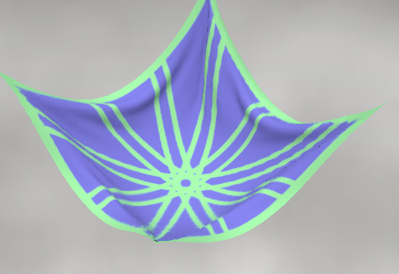
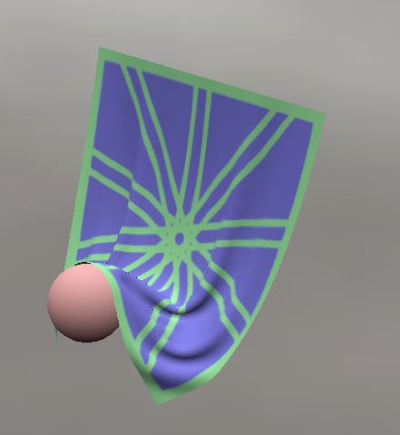

# 機能

## クロスシミュレーション

### 概要
布の動きを再現する物理シミュレーションです。  
現在はGPGPUで計算する方式をとり、処理速度の向上も目指しています。  
動きを確認するデモは[developCloth](https://github.com/NomuraYuu23/JobHunting/tree/developCloth)で確認できます。

### 現在行えること
* 風力と重力を加えることができます。  

* 平面との衝突、押し出し処理ができます。  

* 球との衝突、押し出し処理ができます。  

* カプセルとの衝突、押し出し処理ができます。  

* 分割数の変更ができます。  
8 * 8________________________________________16 * 16______________________________________  
  
32 * 32______________________________________64 * 64______________________________________  

### コード
* [クロスシミュレーションコード](Project/Engine/Physics/ClothGPU/ClothGPU.cpp)  
布の計算、shaderの初期化などを行っているコードです。
* [デモコード](Project/Application/ClothDemo/ClothDemo.cpp)  
布を動きを見るためのコードです。
* [計算のためのCS](Project/Resources/shaders/ClothGPU)  
布を動きを計算するCSです。処理は複数のCSに分かれているので、リンクはまとめてあるフォルダに移動します。

# 詳しい資料

[Notion](https://www.notion.so/Cloth-Simulation-119f9b3a9f56803abef5de984bb4eb9e)に詳しい処理の内容が書かれています。

# 外部ファイル
* assimp
* DirectXTex
* imgui
* nlohmarn
